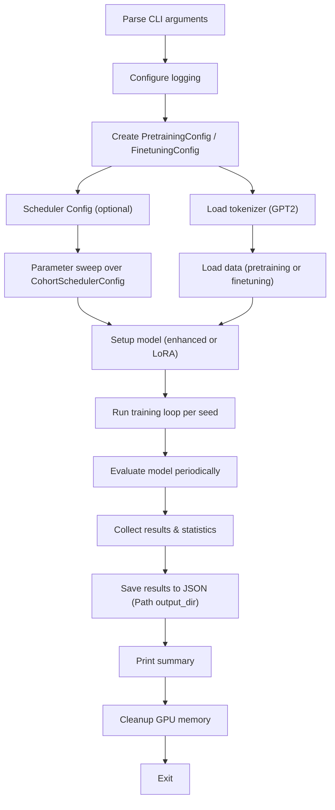

```mermaid
graph TD
    C --> N["Scheduler Config (optional)"]
    N --> O[Parameter sweep over CohortSchedulerConfig]
    O --> F
    A[Parse CLI arguments] --> B[Configure logging]
    B --> C[Create PretrainingConfig / FinetuningConfig]
    C --> D["Load tokenizer (GPT2)"]
    D --> E["Load data (pretraining or finetuning)"]
    E --> F["Setup model (enhanced or LoRA)"]
    F --> G[Run training loop per seed]
    G --> H[Evaluate model periodically]
    H --> I[Collect results & statistics]
    I --> J["Save results to JSON (Path output_dir)"]
    J --> K[Print summary]
    K --> L[Cleanup GPU memory]
    L --> M[Exit]
```