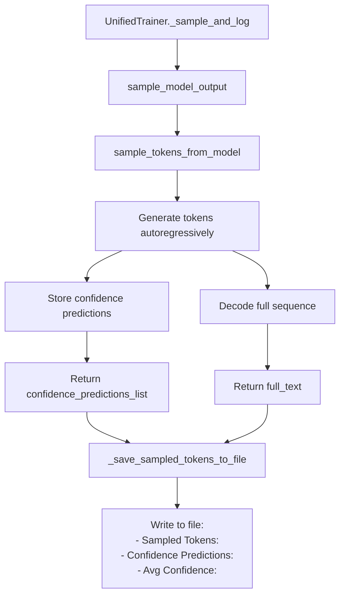
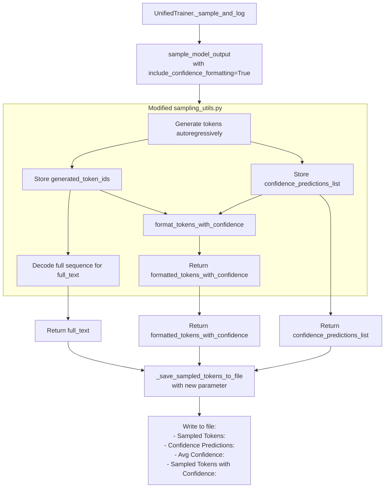

# Confidence Token Pairing - Data Flow Diagram

## Current Data Flow



## Problem: Misalignment
- `full_text` includes prompt + generated tokens
- `confidence_predictions_list` only has values for generated tokens
- No direct mapping between tokens in text and confidence values

## Proposed Solution Flow



## Token Alignment Logic

```
Prompt: "Once upon a time"
Generated tokens: ["was", "a", "old", "how"]
Confidence predictions: [8.6, 7.2, 8.4, 6.8]

Step 1: Get generated_token_ids = [token_id_was, token_id_a, token_id_old, token_id_how]
Step 2: Decode each token individually:
    tokenizer.decode([token_id_was]) -> "was"
    tokenizer.decode([token_id_a]) -> "a"
    tokenizer.decode([token_id_old]) -> "old"
    tokenizer.decode([token_id_how]) -> "how"
Step 3: Pair with confidence:
    "was" + "(8.6)" -> "was(8.6)"
    "a" + "(7.2)" -> "a(7.2)"
    "old" + "(8.4)" -> "old(8.4)"
    "how" + "(6.8)" -> "how(6.8)"
Step 4: Join: "was(8.6) a(7.2) old(8.4) how(6.8)"
```

## Edge Cases Handling

### 1. Special Tokens
- Use `skip_special_tokens=True` in decode
- EOS token stops generation early

### 2. Whitespace in Token Decoding
- Some tokenizers decode "a" as " a" (with leading space)
- Solution: `.strip()` each decoded token

### 3. Tokenizer Variations
- Different tokenizers may have different decode behavior
- Our solution should work with any tokenizer that has `decode()` method

### 4. Confidence List Length Mismatch
- Should never happen if code is correct
- Add validation check in `format_tokens_with_confidence()`

## Implementation Sequence

1. **First**: Modify `sampling_utils.py` to return token IDs
2. **Second**: Add `format_tokens_with_confidence()` function
3. **Third**: Update `sample_model_output()` to use formatting
4. **Fourth**: Update `UnifiedTrainer._sample_and_log()` to receive formatted tokens
5. **Fifth**: Update `UnifiedTrainer._save_sampled_tokens_to_file()` to write new line
6. **Sixth**: Update tests to verify new functionality

## Backward Compatibility

- All existing function signatures remain (with optional new parameters)
- Existing code continues to work without changes
- New functionality is opt-in via `include_confidence_formatting` parameter
- Default behavior: include formatting when confidence predictions available